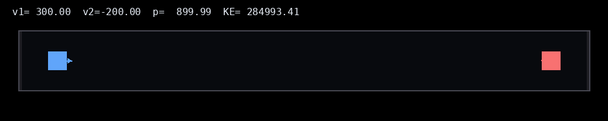

# 1D Physics Collision Engine (AI-Assisted Prototype)



This repository contains a lightweight, interactive 1D physics simulation modeling elastic collisions between two rigid bodies with friction and wall constraints.

The project demonstrates **AI-assisted system development**: using an Perplexity to accelerate implementation while retaining ownership over system design, correctness, and validation.

## Overview

The simulator models two bodies moving along a single axis, with configurable mass, velocity, friction, and restitution. The system updates in real time and visualizes both motion and physical quantities.

The focus is not graphical fidelity, but **correctness, clarity, and rapid prototyping of physical systems**.

## Features

- Elastic collision handling with configurable mass ratios
- Kinetic friction and static stop threshold
- Wall collisions with restitution
- Real-time visualization using HTML Canvas
- Live display of velocity, momentum, and kinetic energy
- Interactive controls for simulation parameters

## Physics Model

- **Collision dynamics:** 1D elastic collision equations derived from conservation of momentum (and KE in the ideal case)
- **Energy behavior:** Kinetic energy tracked; restitution used as an energy-loss knob
- **Friction:** Constant deceleration proportional to `μ·g`
- **Numerical handling:** Overlap resolution applied post-collision to maintain stability

More detail: see [`docs/physics.md`](docs/physics.md).

## Validation

- Verified momentum conservation during elastic collisions when `restitution = 1`
- Verified expected kinetic energy behavior across varying mass ratios
- Tested low-velocity edge cases to confirm stop threshold behavior under friction
- Tested wall collision handling and boundary constraints

Sanity checks live in [`tests/`](tests).

## AI-Assisted Development

Perplexity used to accelerate:

- Generate initial simulation scaffolding
- Translate physical equations into executable logic
- Speed up UI and visualization implementation

All physics assumptions, equations, and edge cases were reviewed, validated, and adjusted manually.

## Run Locally

Open `index.html` in a browser.

## Tests

Requires Node.js (v18+ recommended):

```bash
npm test
```

## Tech Stack

- JavaScript
- HTML Canvas
- CSS

## Future Work

- Continuous collision detection (time-of-impact resolution)
- Variable time-step integration
- Inelastic and partially elastic collision modes
- Multi-body simulation support
